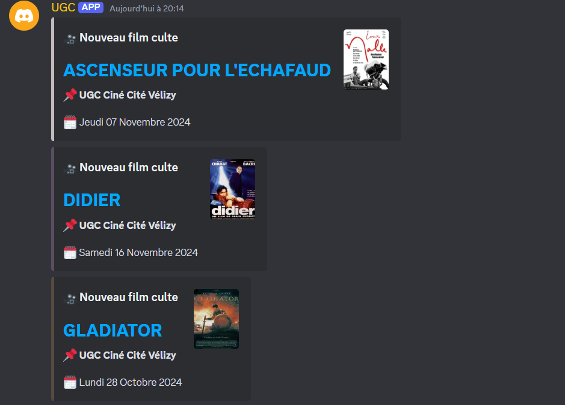

Un bot discord qui notifie quand un film culte est disponible dans un ou plusieurs cinéma(s) de votre choix

# Setup

- Installer python
- Installe les librarires
    `pip install -r requirements.txt`
- Créer un bot discord et ajoute le au fichier .env

# Utilisation

- Utilise la cmd `make run` ou `python bot.py` pour le lancer

# Commandes

- /setup - Pour configurer le channel et/ou le message a envoyé.
- /add_cinema - Ajoute un cinéma
- /remove_cinema - Supprime un cinéma

### Commandes dev

- /reload - Pour reload les cogs quand on dev (jdevrais foutre sa en cmd prefix)

### Commandes dev (hors discord)

dev: Utilise la dev_bdd.sqlite au lieu de bdd.sqlite 

- `make dev` - Pour lancer le script en en mode dev et synchronise 

- `make dev-no-sync` - mode dev et no sync
